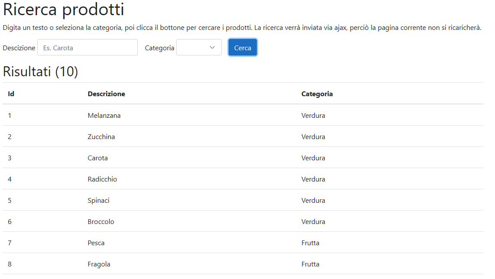

# Ajax form demo
Questa è un'applicazione ASP.NET Core che dimostra l'invio di un form per mezzo di una richiesta ajax. I dati restituiti dal server vengono uniti a un template [Handlebars](https://handlebarsjs.com/) e visualizzati nella pagina. In questo modo, la pagina non deve ricaricarsi completamente.

